<div align="center">

# Modbus Supervisor

**A mobile SCADA for the [ESP32 Modbus Gateway](https://github.com/magnurv12/esp32-modbus-gateway)**
Monitor sensors, command actuators, manage alarms and inspect any Modbus register — from your phone.

**English** · [Português](README.pt-BR.md)


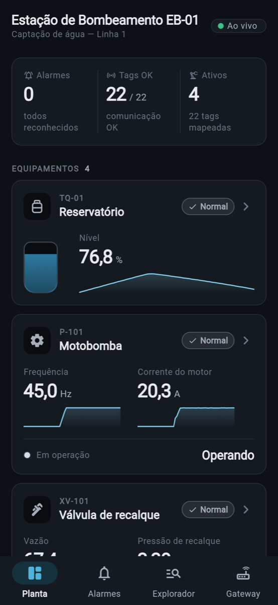
&nbsp;
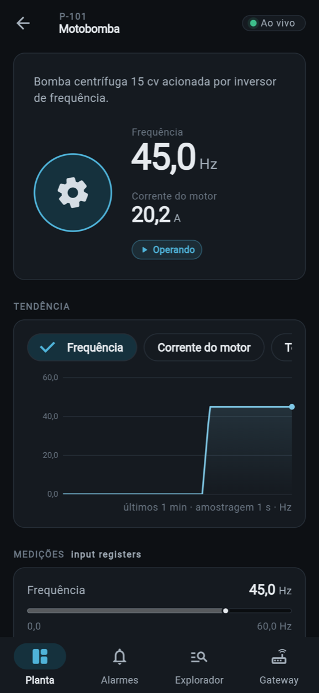
&nbsp;
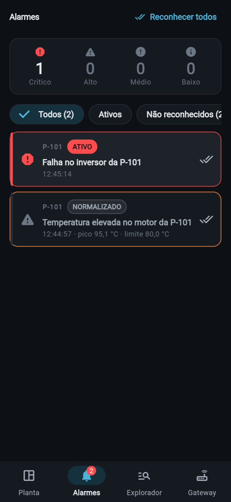

</div>

---

## Contents

- [Why this app exists](#why-this-app-exists)
- [Features](#features)
- [Screenshots](#screenshots)
- [How it talks to the gateway](#how-it-talks-to-the-gateway)
- [Getting started](#getting-started)
- [Configuration](#configuration)
- [Simulating a Modbus slave](#simulating-a-modbus-slave)
- [3-minute demo script](#3-minute-demo-script)
- [Architecture](#architecture)
- [Testing](#testing)
- [Roadmap](#roadmap)

## Why this app exists

Industrial equipment — PLCs, VFDs, energy meters, scales — still speaks
**Modbus RTU over RS-485**, a 1979 serial protocol. The
[ESP32 Modbus Gateway](https://github.com/magnurv12/esp32-modbus-gateway)
turns that bus into a modern **REST + WebSocket API** for about US$10 of
hardware.

This app is the **HMI** on top of it: a supervisory screen that operators
can carry in their pocket. The demo plant is a **water pumping station**
(EB-01) — a suction tank with level switches, a VFD-driven pump, a discharge
valve and an electrical panel with an energy meter — mapped onto all four
Modbus tables.

> **No hardware?** Run with `ENVIRONMENT=demo`. A built-in plant simulator
> with process physics and PLC logic answers exactly like the gateway does.

## Features

| | |
|---|---|
| 🏭 **Live plant overview** | KPIs, one card per equipment, live values with sparklines and running state — streamed over a single WebSocket |
| ⚙️ **Equipment detail** | Animated synoptic (tank level, spinning impeller), trend chart with alarm limit lines, ISA-101 gauges, digital status, commands with confirmation, setpoints with a slider sheet |
| 🚨 **Alarm management** | ISA-18.2 lifecycle (active → normalized → acknowledged), hysteresis, peak value capture, severity summary, swipe to acknowledge |
| 🔍 **Modbus explorer** | Raw read/write on any table, function code, latency, legacy numbering (`40001`), hex/binary views, continuous polling, transaction log |
| 📡 **Gateway health** | Modbus link state, success rate, bus load, WebSocket clients, Wi-Fi signal, firmware, last reset reason |
| 🛡️ **Resilience** | Tag quality (`good` / `stale` / `bad`), connection banner with backoff countdown, pause in background, confirmed writes only |
| 🗺️ **Config-driven plant** | The whole plant lives in `plant.yaml` — point it at your own slave without touching code |

## Screenshots

<table>
  <tr>
    <td align="center"><br/><sub><b>Plant</b> — live overview</sub></td>
    <td align="center"><br/><sub><b>Equipment</b> — synoptic + trend</sub></td>
    <td align="center">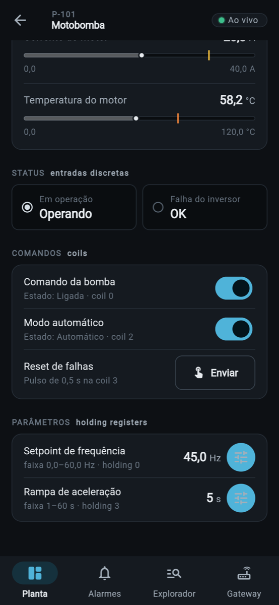<br/><sub><b>Controls</b> — status, coils, setpoints</sub></td>
  </tr>
  <tr>
    <td align="center">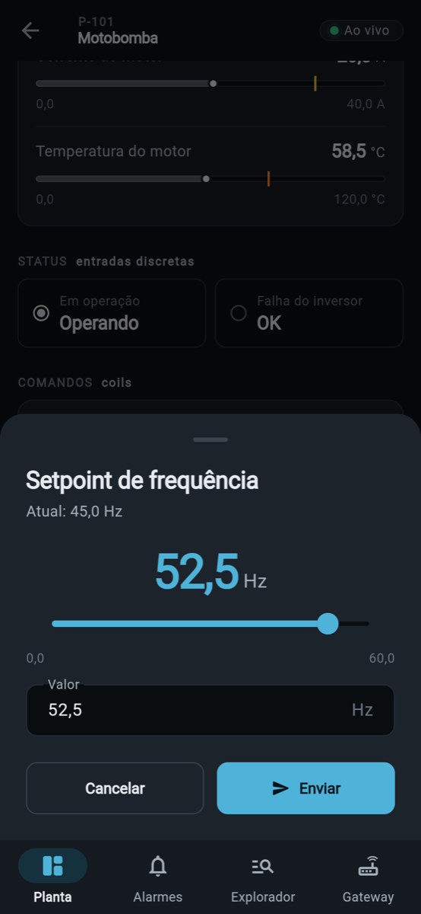<br/><sub><b>Setpoint</b> — validated range</sub></td>
    <td align="center">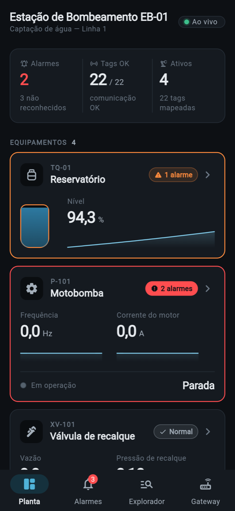<br/><sub><b>Abnormal situation</b> — color only for alarms</sub></td>
    <td align="center"><br/><sub><b>Alarms</b> — ISA-18.2, peak value</sub></td>
  </tr>
  <tr>
    <td align="center">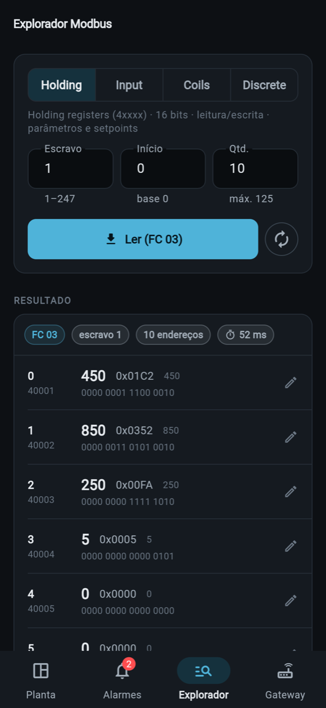<br/><sub><b>Explorer</b> — raw registers, FC, latency</sub></td>
    <td align="center">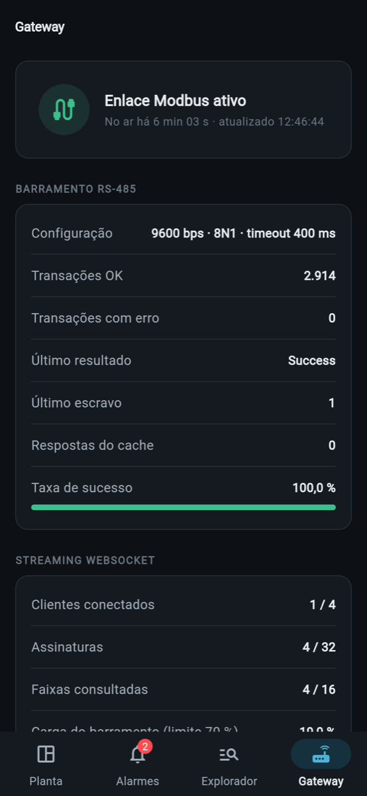<br/><sub><b>Gateway</b> — health &amp; bus stats</sub></td>
    <td align="center">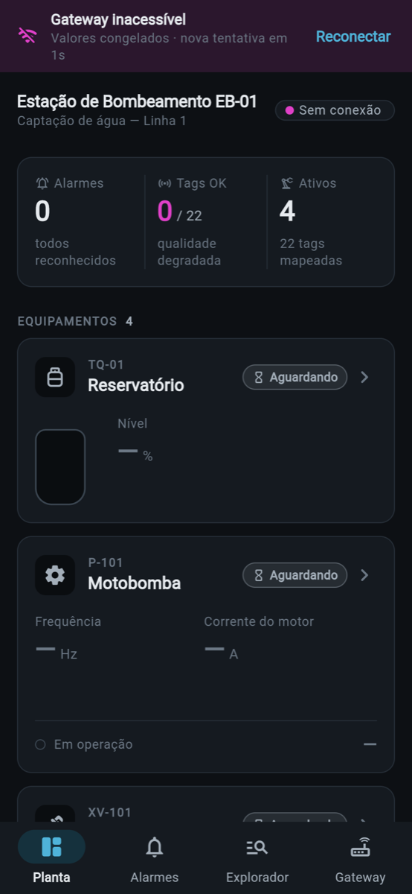<br/><sub><b>Offline</b> — frozen values + auto-reconnect</sub></td>
  </tr>
</table>

## How it talks to the gateway

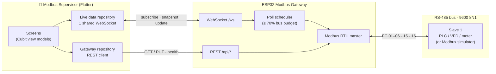

**Wi-Fi** connects the phone to the gateway (`http://modbus-gateway.local`,
published over mDNS). **RS-485** connects the gateway to the slaves. The app
never talks Modbus directly — it speaks JSON, and the gateway owns the bus.

### Which endpoint each screen uses

| Gateway resource | Used by | Purpose |
|---|---|---|
| `ws /ws` (`subscribe` → `snapshot` → `update`) | Plant, Equipment, Alarms | Live values, pushed only when they change |
| `PUT /api/coils/{addr}` · FC 05 | Equipment → Commands | Start/stop pump, open/close valve, reset pulse |
| `PUT /api/holding/{addr}` · FC 06 | Equipment → Setpoints | Frequency, level thresholds, ramp |
| `GET /api/{table}?start=&count=` · FC 01–04 | Explorer | Raw block reads |
| `PUT /api/{table}` · FC 15 / 16 | Explorer | Block writes |
| `GET /api/health` | Gateway | Link, counters, bus load, Wi-Fi, firmware |

### Live data flow

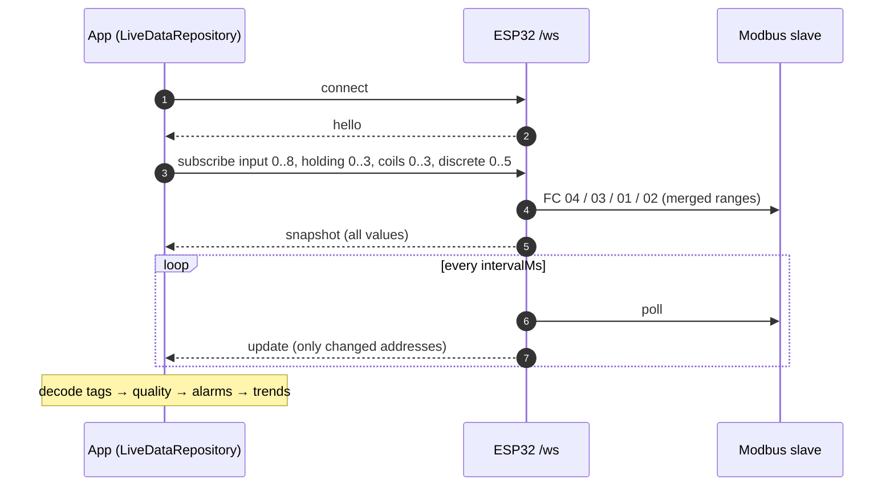

The tag map is grouped into the **fewest possible subscriptions** — the
default plant needs 4 of the 8 allowed per connection — and the whole app
shares **one** socket, since the firmware accepts only 4 clients.

### Confirmed writes

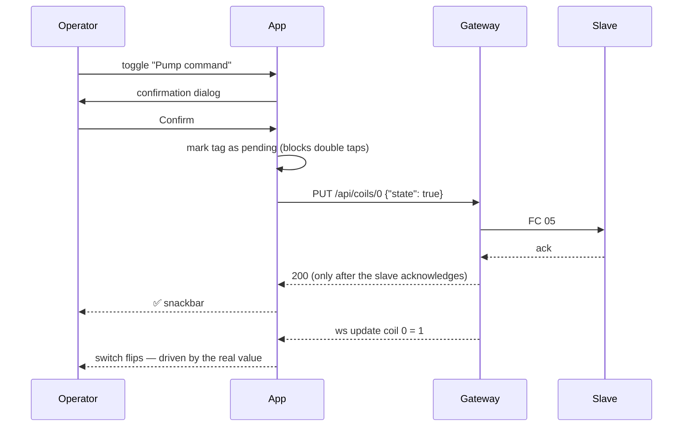

The UI never pretends: the switch changes when the **slave's value** comes
back through the stream, not when the button is pressed.

### Error handling

Every gateway error becomes a typed `Failure` that tells the operator
**what happened, why, and what to do**:

| Gateway says | App shows | Retry? |
|---|---|---|
| DNS / connection refused / CORS | *Gateway unreachable* — check Wi-Fi and that the ESP32 is on | ✅ auto, with backoff |
| `504 slave_timeout` (code 226) | *Modbus slave not responding* — check A/B wiring, slave ID, baud | ✅ |
| `502 slave_failure` / `bad_response` | *Slave internal failure* / *invalid response* + FC, slave, address | — |
| `400 illegal_*` (codes 1–3) | *Address / function / value rejected by the slave* | — |
| `503 busy` | *Gateway busy* — queue full (8 pending) | ✅ |
| `405 read_only` | *Read-only table* | — |
| Out of range, before sending | *Invalid value* — with the allowed range | — |

## Getting started

### Prerequisites

- Flutter **3.47+** (Dart 3.13+)
- For real hardware: an ESP32 running
  [esp32-modbus-gateway](https://github.com/magnurv12/esp32-modbus-gateway),
  on the same Wi-Fi network as the phone, with at least one Modbus slave on
  the RS-485 bus (a real device or [a simulator](#simulating-a-modbus-slave))

### Install

```bash
git clone <repository-url> modbus_supervisor
cd modbus_supervisor
flutter pub get
dart run build_runner build   # freezed / json_serializable (outputs are committed)
```

### Run

**VS Code** (recommended) — open the folder, accept the *Flutter* extension,
pick a device in the status bar, then in **Run and Debug** (⇧⌘D) choose:

| Configuration | What it does |
|---|---|
| **Demo · simulador** | Built-in simulator, no hardware needed |
| **Dev · gateway real** | Connects to the ESP32 |
| **Demo · simulador no Chrome** | Runs in the browser |
| Dev · profile / release | Performance / production build |

Tasks (⇧⌘P → *Tasks: Run Task*): code generation (⇧⌘B), tests, analysis,
APK builds.

**Terminal** — `make` lists every shortcut:

```bash
make demo                  # simulator on the selected device
make dev                   # real gateway
make demo DEVICE=chrome    # pick the device
make check                 # analyze + test
make apk                   # release APK for the real gateway
```

Or plain Flutter: `flutter run --dart-define=ENVIRONMENT=demo`.

> **Android and `.local`:** not every Android device resolves mDNS names.
> If you see *Gateway unreachable*, replace `BASE_URL` in
> `assets/env/env_dev.yaml` with the IP shown by `GET /api/health` or the
> serial monitor.

## Configuration

### Environments — `assets/env/env_<name>.yaml`

`--dart-define=ENVIRONMENT=<name>` selects **which** file is loaded; the
values live in the file (intentionally versioned — there are no secrets).

| Key | Meaning |
|---|---|
| `BASE_URL` | Gateway address, e.g. `http://modbus-gateway.local` |
| `WS_PATH` | WebSocket path (`/ws`) |
| `REQUEST_TIMEOUT_MS` | Must be **longer** than the ~2 s ModbusMaster waits for a silent slave, or the `504` never reaches the app |
| `DEFAULT_SLAVE` | Initial slave ID in the explorer |
| `LIVE_INTERVAL_MS` | `intervalMs` of the WebSocket subscriptions |
| `HEALTH_REFRESH_MS` | Auto-refresh of the Gateway tab |
| `USE_SIMULATOR` | `true` swaps the data sources for the built-in simulator |

### Plant map — `assets/plant/plant.yaml`

Equipment, addresses, data types, scaling, ranges and alarm rules all come
from YAML. To supervise **your** slave, edit this file — no code changes.

```yaml
- id: p101_freq
  name: "Frequência"
  table: input          # holding | input | coils | discrete
  address: 5            # protocol address, 0-based (manual "30006")
  type: uint16          # int16 | uint32 | int32 | float32 | bool
  wordOrder: big        # 32-bit only: big | little (word swap)
  scale: 0.1            # engineering = raw * scale + offset
  unit: "Hz"
  min: 0
  max: 60
  alarms:
    - { when: above, limit: 58, severity: high, message: "Overspeed" }
```

The parser validates every field and points at the exact problem —
`equipments[1].tags[3].table: invalid value "holdin"` — shown on screen
instead of a crash.

### Default register map

| Table | Addr. | Tag | Scale |
|---|---|---|---|
| input | 0 | Tank level | ×0.1 % |
| input | 1 | Discharge pressure | ×0.01 bar |
| input | 2 | Flow | ×0.1 m³/h |
| input | 3 | Motor temperature | ×0.1 °C |
| input | 4 | Motor current | ×0.1 A |
| input | 5 | Frequency | ×0.1 Hz |
| input | 6–7 | Energy (uint32, high word first) | ×0.1 kWh |
| input | 8 | Active power | ×0.1 kW |
| holding | 0 | Frequency setpoint | ×0.1 Hz |
| holding | 1 / 2 | Pump start / stop level (auto) | ×0.1 % |
| holding | 3 | Acceleration ramp | s |
| coils | 0 / 1 / 2 / 3 | Pump / Valve / Auto mode / Fault reset (pulse) | — |
| discrete | 0–5 | Running, VFD fault, LSH, LSL, Panel door, E-stop | — |

> Addresses are **protocol addresses (0-based)** as the gateway API expects.
> Device manuals often use legacy numbering: `40001` = holding address 0,
> `30001` = input 0, `10001` = discrete 0, `00001` = coil 0.

## Simulating a Modbus slave

To demo with the **real gateway** but without industrial hardware, turn a
computer into the slave:

1. Connect a **USB-RS485 adapter** to the same A/B pair as the gateway's MAX485.
2. Open [Modbux](https://github.com/ploxc/modbux) and import
   [`tools/modbux/eb01-slave.json`](tools/modbux/eb01-slave.json) — the full
   register map with initial values.
3. Select the adapter's serial port, **RTU**, **9600 8N1**, **Unit ID 1**,
   **BE**, and start the server.
4. Run the app with `make dev` and read `Holding 0..3` in the Explorer —
   you should get `450, 850, 250, 5`.

Change values in Modbux to trigger alarms (e.g. discrete 1 = 1 → *VFD
fault*, input 0 = 950 → *high level*).

> **macOS: "Modbux is damaged"** — the app is ad-hoc signed and quarantined
> by Gatekeeper. If you trust the download:
> `xattr -dr com.apple.quarantine /Applications/Modbux.app`

## 3-minute demo script

1. **Live plant** — the tank fills; in auto mode the pump starts at the
   high threshold (impeller spins, frequency ramps up).
2. **Confirmed command** — on XV-101, close the valve. The switch only flips
   when the slave confirms.
3. **Abnormal situation** — pump against a closed valve: the motor heats →
   high alarm → VFD trips (critical) → level rises → high-level alarm. The
   alarm badge takes the color of the worst severity.
4. **ISA-18.2 alarms** — the temperature alarm stays as *normalized,
   unacknowledged* with its **peak** value. Acknowledge it, reopen the valve
   and send the *Fault reset* pulse.
5. **Explorer** — read `holding 0..9` (FC 03, ~50 ms), edit register 0
   (FC 06) and watch the setpoint change on the equipment screen.
6. **Resilience** — power off the ESP32: connection banner, faded values
   (*stale* quality), reconnection with 1 → 2 → 5 → 10 → 15 s backoff.

## Architecture

Clean Architecture in three layers plus MVVM with Cubit — the same approach
as [rickandmorty-fullstack](https://github.com/magnurv12/rickandmorty-fullstack)
and [tractian_challenge](https://github.com/magnurv12/tractian_challenge).

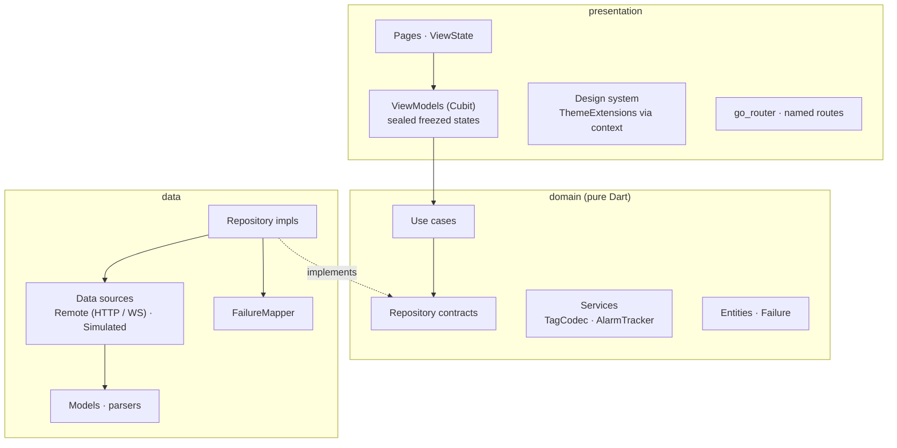

```
lib/
├── main.dart                 # Env.load → setupInjector → runApp
└── src/
    ├── app_widget.dart       # MaterialApp.router, theme, pt-BR locale
    ├── injector.dart         # get_it: singletons + view model factories
    ├── core/
    │   ├── env/              # immutable Env loaded from YAML
    │   ├── mvvm/             # ViewModel (Cubit), ViewState, DM, one-shot effects
    │   └── network/          # ApiClient + transport exceptions
    ├── domain/
    │   ├── entities/         # Plant, Equipment, TagDefinition, Alarm, PlantLiveState…
    │   ├── failures/         # sealed Failure
    │   ├── repositories/     # contracts
    │   ├── services/         # TagCodec (16/32-bit, float, word order), AlarmTracker
    │   └── usecases/         # I<Name>UseCase + implementation
    ├── data/
    │   ├── datasources/      # Remote (http, web_socket_channel) and Simulated
    │   ├── live/             # SubscriptionPlanner
    │   ├── mappers/          # FailureMapper: HTTP / WS / Modbus → Failure
    │   ├── models/           # freezed/json models, API/WS/YAML parsers
    │   ├── repositories/     # implementations
    │   └── simulator/        # PlantSimulator (process physics + PLC logic)
    └── presentation/
        ├── design_system/    # tokens, theme, Ds* components
        ├── router/           # go_router, named routes
        ├── shared/           # formatters, presenters, shared widgets
        └── views/<feature>/  # page · state · viewmodel · widgets
```

### Design decisions

- **Unidirectional error flow.** Data sources throw transport exceptions;
  repositories turn everything into `Either<Failure, T>` through a single
  `FailureMapper`; the presentation layer only knows `Failure`.
- **One WebSocket for the whole app.** The live repository is a singleton,
  subscribes to grouped ranges, pauses in background (freeing one of the
  gateway's 4 client slots) and reconnects with exponential backoff.
- **Explicit data quality**, as in real SCADA: a frozen value never looks
  like a current one.
- **Sealed states + exhaustive `switch`.** Each screen's state is a sealed
  `freezed` union; the compiler guarantees every case is rendered.
- **One-shot effects** (snackbars, haptics) go through a separate stream
  (`ViewModelEffects`), not through state, so they never replay on rebuild.
- **Pure domain services.** Register decoding and alarm rules are plain Dart,
  unit-tested without Flutter.
- **Design system inherited through `context`.** Colors, spacing, radii,
  typography and motion are `ThemeExtension`s; Material components are
  themed globally; screens read `context.colors`, `context.spacing`,
  `context.ds`. The palette follows **ISA-101** (high-performance HMI):
  grey for normal operation, color only for abnormal situations, magenta for
  communication loss, and a different icon *shape* per alarm priority so it
  stays readable without color.

### Stack

`flutter_bloc` (Cubit) · `get_it` · `go_router` · `freezed` ·
`json_serializable` · `either_dart` · `http` · `web_socket_channel` ·
`yaml` · `intl` — charts and gauges are hand-written `CustomPainter`s.

## Testing

```bash
make check     # flutter analyze + flutter test
```

| Layer | What is covered |
|---|---|
| Domain | Tag codec (int16, uint32/int32/float32 in both word orders), alarm lifecycle, hysteresis, peak capture, use case validation, pulse command |
| Data | Failure mapping for every gateway error, API/WS/YAML parsing, subscription planning, live repository (snapshot, update, quality, reconnect, pause) |
| Presentation | View models with `bloc_test`, setpoint sheet validation, full-app smoke test against the simulator |

## Roadmap

- Persistent trend history
- Push notification for critical alarms
- Multiple plant maps with a plant picker
- Light theme toggle for outdoor use (already designed, see `DsColors.light`)
