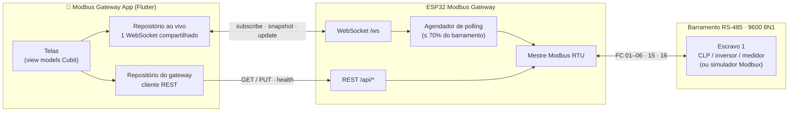
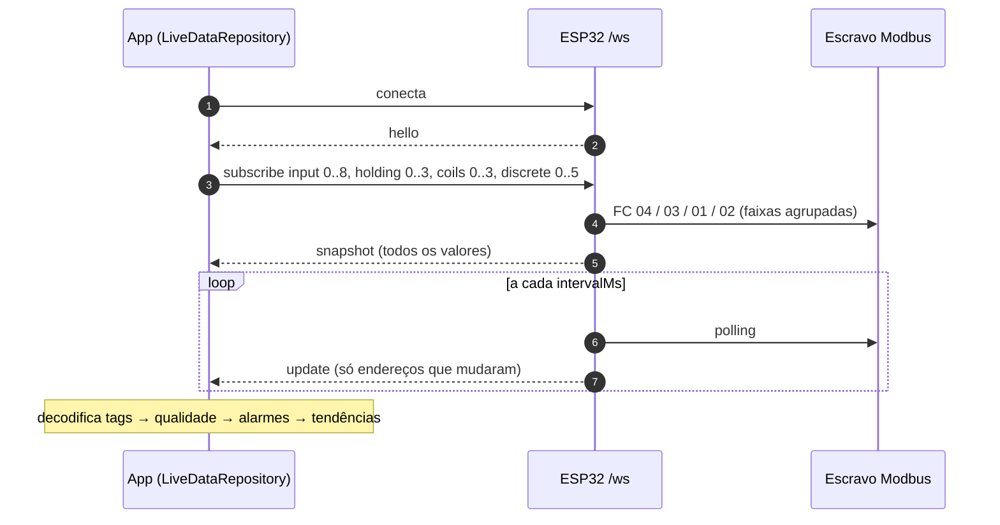
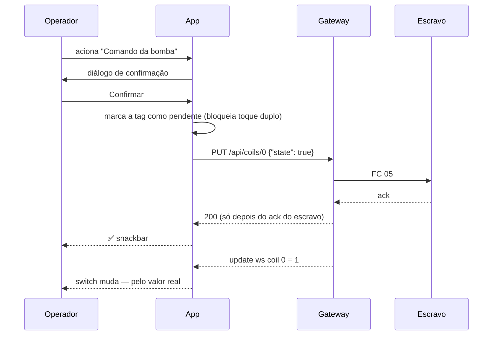
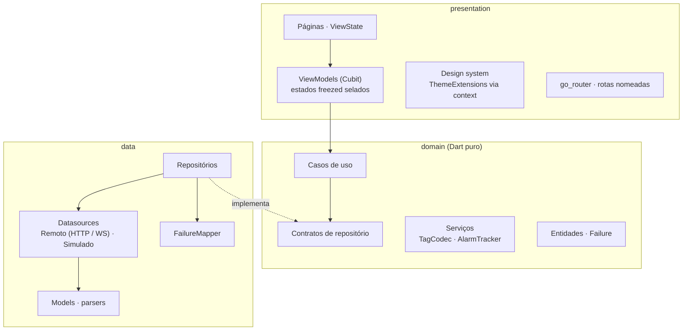

<div align="center">

# Modbus Gateway

**Um SCADA mobile para o [ESP32 Modbus Gateway](https://github.com/magnurv12/esp32-modbus-gateway)**
Monitore sensores, comande atuadores, gerencie alarmes e inspecione qualquer registrador Modbus — pelo celular.

[English](README.md) · **Português**


&nbsp;

&nbsp;


</div>

---

## Sumário

- [Para que serve](#para-que-serve)
- [Funcionalidades](#funcionalidades)
- [Telas](#telas)
- [Como o app conversa com o gateway](#como-o-app-conversa-com-o-gateway)
- [Instalação e execução](#instalação-e-execução)
- [Configuração](#configuração)
- [Simulando um escravo Modbus](#simulando-um-escravo-modbus)
- [Roteiro de demonstração (3 min)](#roteiro-de-demonstração-3-min)
- [Arquitetura](#arquitetura)
- [Testes](#testes)
- [Próximos passos](#próximos-passos)

## Para que serve

Equipamentos industriais — CLPs, inversores de frequência, medidores de
energia, balanças — ainda falam **Modbus RTU sobre RS-485**, um protocolo
serial de 1979. O [ESP32 Modbus Gateway](https://github.com/magnurv12/esp32-modbus-gateway)
transforma esse barramento numa **API REST + WebSocket** moderna com cerca
de US$ 10 em hardware.

Este app é a **IHM** em cima dele: uma tela de supervisório que o operador
leva no bolso. A planta de demonstração é uma **estação de bombeamento de
água** (EB-01) — reservatório com chaves de nível, motobomba com inversor,
válvula de recalque e painel elétrico com medidor de energia — usando as
quatro tabelas do Modbus.

> **Sem hardware?** Rode com `ENVIRONMENT=demo`. Um simulador embutido, com
> física de processo e lógica de CLP, responde exatamente como o gateway.

## Funcionalidades

| | |
|---|---|
| 🏭 **Planta ao vivo** | Indicadores gerais, um card por equipamento, valores ao vivo com minigráficos e estado de operação — tudo por um único WebSocket |
| ⚙️ **Detalhe do equipamento** | Sinótico animado (nível do tanque, rotor girando), tendência com linhas de alarme, gauges ISA-101, status digitais, comandos com confirmação e setpoints com slider |
| 🚨 **Gestão de alarmes** | Ciclo ISA-18.2 (ativo → normalizado → reconhecido), histerese, registro do valor de pico, resumo por severidade, deslizar para reconhecer |
| 🔍 **Explorador Modbus** | Leitura/escrita direta em qualquer tabela, código de função, latência, numeração de manual (`40001`), hex/binário, leitura contínua, log de transações |
| 📡 **Saúde do gateway** | Estado do enlace Modbus, taxa de sucesso, carga do barramento, clientes WebSocket, sinal Wi-Fi, firmware, motivo do último reset |
| 🛡️ **Resiliência** | Qualidade do dado (`good` / `stale` / `bad`), banner de conexão com contagem regressiva, pausa em segundo plano, só escritas confirmadas |
| 🗺️ **Planta configurável** | A planta inteira fica em `plant.yaml` — aponte para o seu escravo sem mexer no código |

## Telas

<table>
  <tr>
    <td align="center"><br/><sub><b>Planta</b> — visão ao vivo</sub></td>
    <td align="center"><br/><sub><b>Equipamento</b> — sinótico + tendência</sub></td>
    <td align="center"><br/><sub><b>Controles</b> — status, coils, setpoints</sub></td>
  </tr>
  <tr>
    <td align="center"><br/><sub><b>Setpoint</b> — faixa validada</sub></td>
    <td align="center"><br/><sub><b>Situação anormal</b> — cor só em alarme</sub></td>
    <td align="center"><br/><sub><b>Alarmes</b> — ISA-18.2, valor de pico</sub></td>
  </tr>
  <tr>
    <td align="center"><br/><sub><b>Explorador</b> — registradores, FC, latência</sub></td>
    <td align="center"><br/><sub><b>Gateway</b> — saúde e barramento</sub></td>
    <td align="center"><br/><sub><b>Offline</b> — valores congelados + reconexão</sub></td>
  </tr>
</table>

## Como o app conversa com o gateway



O **Wi-Fi** liga o celular ao gateway (`http://modbus-gateway.local`,
publicado via mDNS). O **RS-485** liga o gateway aos escravos. O app nunca
fala Modbus diretamente — ele fala JSON, e o gateway é o dono do barramento.

### Qual endpoint cada tela usa

| Recurso do gateway | Usado por | Para quê |
|---|---|---|
| `ws /ws` (`subscribe` → `snapshot` → `update`) | Planta, Equipamento, Alarmes | Valores ao vivo, enviados só quando mudam |
| `PUT /api/coils/{end}` · FC 05 | Equipamento → Comandos | Ligar/desligar bomba, abrir/fechar válvula, pulso de reset |
| `PUT /api/holding/{end}` · FC 06 | Equipamento → Parâmetros | Frequência, níveis de partida/parada, rampa |
| `GET /api/{tabela}?start=&count=` · FC 01–04 | Explorador | Leitura de blocos |
| `PUT /api/{tabela}` · FC 15 / 16 | Explorador | Escrita em bloco |
| `GET /api/health` | Gateway | Enlace, contadores, carga, Wi-Fi, firmware |

### Fluxo dos dados ao vivo



O mapa de tags é agrupado no **menor número possível de assinaturas** — a
planta padrão usa 4 das 8 permitidas por conexão — e o app inteiro
compartilha **um** socket, porque o firmware aceita só 4 clientes.

### Escritas confirmadas



A interface nunca "finge": o switch muda quando o **valor do escravo**
volta pelo streaming, não quando o botão é tocado.

### Tratamento de erro

Todo erro do gateway vira uma `Failure` tipada que diz ao operador **o que
aconteceu, por quê e o que fazer**:

| O gateway responde | O app mostra | Repetir? |
|---|---|---|
| DNS / conexão recusada / CORS | *Gateway inacessível* — confira o Wi-Fi e se o ESP32 está ligado | ✅ automático, com backoff |
| `504 slave_timeout` (código 226) | *Escravo Modbus sem resposta* — confira fiação A/B, id do escravo, baud | ✅ |
| `502 slave_failure` / `bad_response` | *Falha interna do escravo* / *resposta inválida* + FC, escravo, endereço | — |
| `400 illegal_*` (códigos 1–3) | *Endereço / função / valor rejeitado pelo escravo* | — |
| `503 busy` | *Gateway ocupado* — fila cheia (8 pendentes) | ✅ |
| `405 read_only` | *Tabela somente leitura* | — |
| Fora da faixa, antes de enviar | *Valor inválido* — com a faixa permitida | — |

## Instalação e execução

### Pré-requisitos

- Flutter **3.47+** (Dart 3.13+)
- Para hardware real: um ESP32 com o
  [esp32-modbus-gateway](https://github.com/magnurv12/esp32-modbus-gateway),
  na mesma rede Wi-Fi do celular, com ao menos um escravo Modbus no
  barramento RS-485 (um equipamento real ou [um simulador](#simulando-um-escravo-modbus))

### Instalar

```bash
git clone <url-do-repositorio> modbus_gateway_app
cd modbus_gateway_app
flutter pub get
dart run build_runner build   # freezed / json_serializable (gerados já versionados)
```

### Executar

**VS Code** (recomendado) — abra a pasta, aceite a extensão *Flutter*,
escolha o dispositivo na barra de status e, em **Run and Debug** (⇧⌘D):

| Configuração | O que faz |
|---|---|
| **Demo · simulador** | Simulador embutido, sem hardware |
| **Dev · gateway real** | Conecta no ESP32 |
| **Demo · simulador no Chrome** | Roda no navegador |
| Dev · profile / release | Build de desempenho / produção |

Tarefas (⇧⌘P → *Tasks: Run Task*): gerar código (⇧⌘B), testes, análise,
build de APK.

**Terminal** — `make` lista todos os atalhos:

```bash
make demo                  # simulador no dispositivo selecionado
make dev                   # gateway real
make demo DEVICE=chrome    # escolhendo o dispositivo
make check                 # análise + testes
make apk                   # APK release para o gateway real
```

Ou Flutter puro: `flutter run --dart-define=ENVIRONMENT=demo`.

> **Android e `.local`:** nem todo Android resolve nomes mDNS. Se aparecer
> *Gateway inacessível*, troque o `BASE_URL` em `assets/env/env_dev.yaml`
> pelo IP mostrado em `GET /api/health` ou no monitor serial.

## Configuração

### Ambientes — `assets/env/env_<nome>.yaml`

O `--dart-define=ENVIRONMENT=<nome>` escolhe **qual** arquivo carregar; os
valores ficam no arquivo (versionado de propósito — não há segredos).

| Chave | Significado |
|---|---|
| `BASE_URL` | Endereço do gateway, ex.: `http://modbus-gateway.local` |
| `WS_PATH` | Caminho do WebSocket (`/ws`) |
| `REQUEST_TIMEOUT_MS` | Precisa ser **maior** que os ~2 s que o ModbusMaster espera um escravo mudo, senão o `504` nunca chega ao app |
| `DEFAULT_SLAVE` | Escravo inicial no explorador |
| `LIVE_INTERVAL_MS` | `intervalMs` das assinaturas WebSocket |
| `HEALTH_REFRESH_MS` | Atualização automática da aba Gateway |
| `USE_SIMULATOR` | `true` troca os datasources pelo simulador embutido |

### Mapa da planta — `assets/plant/plant.yaml`

Equipamentos, endereços, tipos, escalas, faixas e alarmes vêm do YAML.
Para supervisionar **o seu** escravo, edite o arquivo — sem mudar código.

```yaml
- id: p101_freq
  name: "Frequência"
  table: input          # holding | input | coils | discrete
  address: 5            # endereço do protocolo, base 0 (manual "30006")
  type: uint16          # int16 | uint32 | int32 | float32 | bool
  wordOrder: big        # só 32 bits: big | little (word swap)
  scale: 0.1            # engenharia = bruto * scale + offset
  unit: "Hz"
  min: 0
  max: 60
  alarms:
    - { when: above, limit: 58, severity: high, message: "Sobrevelocidade" }
```

O parser valida cada campo e aponta o problema exato —
`equipments[1].tags[3].table: valor "holdin" inválido` — exibido na tela em
vez de um crash.

### Mapa de registradores padrão

| Tabela | End. | Tag | Escala |
|---|---|---|---|
| input | 0 | Nível do reservatório | ×0,1 % |
| input | 1 | Pressão de recalque | ×0,01 bar |
| input | 2 | Vazão | ×0,1 m³/h |
| input | 3 | Temperatura do motor | ×0,1 °C |
| input | 4 | Corrente do motor | ×0,1 A |
| input | 5 | Frequência | ×0,1 Hz |
| input | 6–7 | Energia (uint32, palavra alta primeiro) | ×0,1 kWh |
| input | 8 | Potência ativa | ×0,1 kW |
| holding | 0 | Setpoint de frequência | ×0,1 Hz |
| holding | 1 / 2 | Nível para ligar / desligar a bomba (auto) | ×0,1 % |
| holding | 3 | Rampa de aceleração | s |
| coils | 0 / 1 / 2 / 3 | Bomba / Válvula / Modo auto / Reset de falhas (pulso) | — |
| discrete | 0–5 | Operando, Falha do inversor, LSH, LSL, Porta do painel, Emergência | — |

> Os endereços são **do protocolo (base 0)**, como a API do gateway espera.
> Manuais costumam usar a numeração antiga: `40001` = holding 0,
> `30001` = input 0, `10001` = discrete 0, `00001` = coil 0.

## Simulando um escravo Modbus

Para demonstrar com o **gateway real** mas sem equipamento industrial,
transforme um computador no escravo:

1. Ligue um **adaptador USB-RS485** no mesmo par A/B do MAX485 do gateway.
2. Abra o [Modbux](https://github.com/ploxc/modbux) e importe
   [`tools/modbux/eb01-slave.json`](tools/modbux/eb01-slave.json) — o mapa
   completo com valores iniciais.
3. Selecione a porta serial do adaptador, **RTU**, **9600 8N1**,
   **Unit ID 1**, **BE**, e inicie o servidor.
4. Rode o app com `make dev` e leia `Holding 0..3` no Explorador — devem
   voltar `450, 850, 250, 5`.

Mude valores no Modbux para disparar alarmes (ex.: discrete 1 = 1 →
*falha do inversor*, input 0 = 950 → *nível alto*).

> **macOS: "Modbux is damaged"** — o app tem assinatura ad-hoc e fica em
> quarentena pelo Gatekeeper. Se você confia no download:
> `xattr -dr com.apple.quarantine /Applications/Modbux.app`

## Roteiro de demonstração (3 min)

1. **Planta ao vivo** — o tanque enche; em automático a bomba parte no
   nível alto (rotor gira, frequência sobe na rampa).
2. **Comando confirmado** — na XV-101, feche a válvula. O switch só muda
   quando o escravo confirma.
3. **Situação anormal** — bomba contra válvula fechada: o motor aquece →
   alarme alto → desarme do inversor (crítico) → nível sobe → alarme de
   nível alto. O badge de alarmes assume a cor da pior severidade.
4. **Alarmes ISA-18.2** — o alarme de temperatura fica como *normalizado,
   não reconhecido*, com o valor de **pico**. Reconheça, reabra a válvula e
   envie o pulso de *Reset de falhas*.
5. **Explorador** — leia `holding 0..9` (FC 03, ~50 ms), edite o
   registrador 0 (FC 06) e veja o setpoint mudar na tela do equipamento.
6. **Resiliência** — desligue o ESP32: banner de conexão, valores
   esmaecidos (qualidade *stale*), reconexão com backoff 1 → 2 → 5 → 10 → 15 s.

## Arquitetura

Clean Architecture em três camadas mais MVVM com Cubit — a mesma abordagem
de [rickandmorty-fullstack](https://github.com/magnurv12/rickandmorty-fullstack)
e [tractian_challenge](https://github.com/magnurv12/tractian_challenge).



```
lib/
├── main.dart                 # Env.load → setupInjector → runApp
└── src/
    ├── app_widget.dart       # MaterialApp.router, tema, locale pt-BR
    ├── injector.dart         # get_it: singletons + factories de view model
    ├── core/
    │   ├── env/              # Env imutável lido do YAML
    │   ├── mvvm/             # ViewModel (Cubit), ViewState, DM, efeitos únicos
    │   └── network/          # ApiClient + exceções de transporte
    ├── domain/
    │   ├── entities/         # Plant, Equipment, TagDefinition, Alarm, PlantLiveState…
    │   ├── failures/         # Failure selada
    │   ├── repositories/     # contratos
    │   ├── services/         # TagCodec (16/32 bits, float, word order), AlarmTracker
    │   └── usecases/         # I<Nome>UseCase + implementação
    ├── data/
    │   ├── datasources/      # Remoto (http, web_socket_channel) e Simulado
    │   ├── live/             # SubscriptionPlanner
    │   ├── mappers/          # FailureMapper: HTTP / WS / Modbus → Failure
    │   ├── models/           # models freezed/json, parsers de API/WS/YAML
    │   ├── repositories/     # implementações
    │   └── simulator/        # PlantSimulator (física + lógica de CLP)
    └── presentation/
        ├── design_system/    # tokens, tema, componentes Ds*
        ├── router/           # go_router, rotas nomeadas
        ├── shared/           # formatters, presenters, widgets comuns
        └── views/<feature>/  # page · state · viewmodel · widgets
```

### Decisões de projeto

- **Fluxo de erro unidirecional.** Datasources lançam exceções de
  transporte; repositórios convertem tudo em `Either<Failure, T>` por um
  único `FailureMapper`; a apresentação só conhece `Failure`.
- **Um WebSocket para o app inteiro.** O repositório ao vivo é singleton,
  assina faixas agrupadas, pausa em segundo plano (liberando uma das 4
  vagas de cliente do gateway) e reconecta com backoff exponencial.
- **Qualidade de dado explícita**, como em SCADA de verdade: valor
  congelado nunca parece valor atual.
- **Estados selados + `switch` exaustivo.** O estado de cada tela é uma
  união `freezed` selada; o compilador garante que todo caso é renderizado.
- **Efeitos de uso único** (snackbar, vibração) saem por um stream
  separado (`ViewModelEffects`), não pelo estado — não se repetem em rebuild.
- **Serviços de domínio puros.** Decodificação de registradores e regras
  de alarme são Dart puro, testados sem Flutter.
- **Design system herdado pelo `context`.** Cores, espaçamento, raios,
  tipografia e movimento são `ThemeExtension`s; os componentes Material são
  configurados no tema global; as telas usam `context.colors`,
  `context.spacing`, `context.ds`. A paleta segue a **ISA-101** (IHM de alto
  desempenho): cinza na operação normal, cor só em situação anormal,
  magenta para falha de comunicação e **forma** de ícone diferente por
  prioridade de alarme, legível mesmo sem cor.

### Stack

`flutter_bloc` (Cubit) · `get_it` · `go_router` · `freezed` ·
`json_serializable` · `either_dart` · `http` · `web_socket_channel` ·
`yaml` · `intl` — gráficos e gauges são `CustomPainter`s próprios.

## Testes

```bash
make check     # flutter analyze + flutter test
```

| Camada | O que é coberto |
|---|---|
| Domínio | Codec de tags (int16, uint32/int32/float32 nas duas ordens de palavra), ciclo de alarmes, histerese, pico, validação dos casos de uso, comando de pulso |
| Data | Mapeamento de todos os erros do gateway, parsing de API/WS/YAML, planejamento de assinaturas, repositório ao vivo (snapshot, update, qualidade, reconexão, pausa) |
| Apresentação | View models com `bloc_test`, validação do ajuste de setpoint, smoke test do app inteiro com o simulador |

## Próximos passos

- Histórico persistente das tendências
- Notificação push para alarmes críticos
- Vários mapas de planta com seletor
- Alternância para o tema claro em campo (já desenhado, ver `DsColors.light`)
